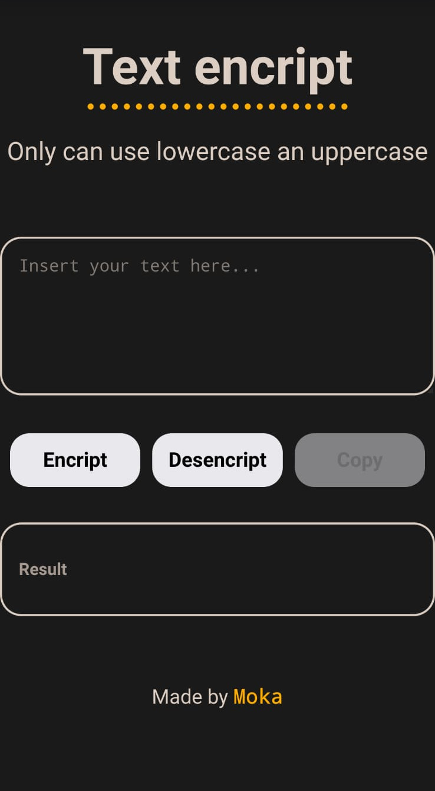

# TextEncript
Este encriptador de texto es uno de los desafios de ALORA



## Uso
1- Insertar el texto que se desea encriptar o desencriptar en el primer area de texto.
2- Presionar la opcion que se desea realizar.
3- El boton de copiar se acriva una vez se haya encriptado o desencriptado un texto. el mismo guarda en el portapapeles el texto resultante. 

<!-- 
# Nombre del Proyecto

Breve descripción o resumen del proyecto.

## Table of Contents

- [Instalación](#instalación)
- [Uso](#uso)
- [Contribución](#contribución)
- [Estructura del Proyecto](#estructura-del-proyecto)
- [Licencia](#licencia)
- [Contacto](#contacto)

## Instalación

Proporciona instrucciones paso a paso sobre cómo instalar y configurar el proyecto. Puedes incluir ejemplos de comandos o scripts.

```bash
# Ejemplo de comandos de instalación
npm install 
-->